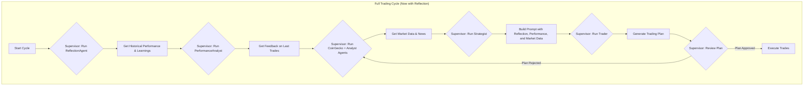

# ChatGPT-Kraken Portfolio Bot — Initial Implementation

## 🧠 Concept

A fully autonomous crypto trading bot powered by ChatGPT 4o with institutional-grade market intelligence.
It runs daily at 07:00 AM MST, evaluates the market using real-time data and comprehensive news analysis, and rebalances a portfolio of Kraken-listed tokens with the goal of generating consistent alpha vs BTC and ETH.
The strategy is experimental, transparent, and performance-logged.

## ⚡ Latest Enhancements (August 2025)

**🧠 REFLECTIVE INTELLIGENCE UPGRADE (August 11, 2025):** Historical Context & Self-Correction - IMPLEMENTED ✅
- **Problem Solved:** 413 Request Entity Too Large from OpenAI due to oversized prompts (long cognitive transcripts + verbose context).
- **Root Cause:** `<COGNITIVE_HISTORY>` injected raw transcripts; no holistic prompt-size budgeting across sections.
- **Technical Solution:**
  - **Reflection via Gemini 2.5 Pro:** `ReflectionAgent` now uses `gemini-2.5-pro` (1M context) to analyze long history and produce a compact JSON reflection. See `bot/gemini_client.py` and `bot/reflection_prompt_template.md`.
  - **Lean Downstream Context:** Removed `<COGNITIVE_HISTORY>` from `bot/prompt_template.md`. Only the compact `historical_reflection` text is passed to `gpt-4o`.
  - **Preflight Size Logs:** Added prompt-size logging (chars, est tokens) in `PromptEngine` and `TraderAgent` before API calls.
- **Files Modified / Added:**
  - `agents/reflection_agent.py` (Gemini integration, bounded transcripts, compact output)
  - `bot/gemini_client.py` (NEW)
  - `bot/reflection_prompt_template.md` (NEW)
  - `bot/prompt_template.md` (removed `<COGNITIVE_HISTORY>`)
  - `bot/prompt_engine.py` (removed `cognitive_history` arg; added size logs)
  - `agents/strategist_agent.py` (stopped passing `cognitive_history`)
  - `requirements.txt` (added `google-generativeai`)
- **Impact:** Eliminates prompt bloat to OpenAI, while upgrading reflection quality via Gemini's 1M-token context. Trader prompts are leaner and more reliable.
- **Config:** Set `GEMINI_API_KEY` env. Optional overrides: `GEMINI_REFLECTION_MODEL`, `GEMINI_TEMPERATURE`, `GEMINI_TOP_P`, `GEMINI_MAX_OUTPUT_TOKENS`.
- **Status:** ✅ PRODUCTION READY

**🛡️ ROBUSTNESS UPGRADE (August 2025):** Market Intelligence Pipeline - IMPLEMENTED ✅
- **Problem Solved:** The bot was consistently failing to gather any relevant news headlines, causing the AI to operate without crucial market context and leading to poor decision-making quality.
- **Root Cause Analysis:**
  1.  **Stale RSS Feeds:** Many of the hardcoded RSS feed URLs in `bot/research_agent.py` were outdated or inactive, resulting in failed requests.
  2.  **Aggressive Caching:** The caching logic was not correctly clearing itself between runs and was overly aggressive, incorrectly flagging new articles as duplicates.
  3.  **Fragile Date Parsing:** The previous date parsing logic could not handle the variety of timestamp formats found across different RSS feeds.
  4.  **Generic User-Agent:** Requests were being made with a default User-Agent, increasing the risk of being blocked by news source firewalls.
- **Technical Solution:**
  - **Overhauled RSS Feeds:** Conducted a web search to find and implement a new, verified list of high-quality crypto and macro news RSS feeds for 2025. Removed all dead links.
  - **Intelligent Cache Control:** Refactored the `SupervisorAgent` to take explicit control over data freshness. It now passes a `bypass_cache=True` flag to the `AnalystAgent` at the start of every trading cycle and, critically, during refinement loops. This ensures the AI always has the freshest possible data.
  - **Robust Date Parsing:** Replaced the fragile, format-specific date parsing with the `python-dateutil` library, which can intelligently parse almost any common date format.
  - **Standardized User-Agent:** All RSS feed requests are now made with a standard browser User-Agent to maximize compatibility and avoid automated blocking.
- **Files Modified:**
  - `bot/research_agent.py`: Updated RSS feed list, integrated `dateutil` for parsing, and added a standard User-Agent to requests.
  - `agents/supervisor_agent.py`: Implemented logic to control the `bypass_cache` flag for the `AnalystAgent`.
  - `agents/analyst_agent.py`: Modified to correctly pass the `bypass_cache` flag down to the `ResearchAgent`.
- **Impact:** The market intelligence pipeline is now significantly more resilient and reliable. The bot can successfully gather a rich set of fresh news headlines, providing the AI with the high-quality, real-time context it needs to make informed, intelligent trading decisions.
- **Status:** ✅ PRODUCTION READY - The bot's ability to see and understand the market is fully restored.

**🤖 AUTONOMY UPGRADE (August 9, 2025):** Refinement Loop Robustness - IMPLEMENTED ✅
- **Problem Solved:** The refinement loop, designed to ask the AI for a better plan when its first one was invalid, was failing. The AI would often propose the same invalid trade again, causing the system to hit its `max_refinement_loops` limit and abort the trading cycle.
- **Root Cause:**
  1.  **Intelligence Starvation:** The `ResearchAgent`'s cache prevented it from re-processing recent news when the refinement loop was triggered just seconds after the initial run. The AI was being asked for a new plan without any new information.
  2.  **Insufficiently Specific Query:** The Supervisor's request for a new plan was too generic. It didn't explain *why* the previous plan was rejected, making it hard for the AI to correct its mistake.
  3.  **"Impossible Puzzle" Constraint:** The AI lacked a clear instruction on what to do if its highest-conviction trade was mathematically impossible to execute for a small portfolio due to minimum order sizes.
- **Technical Solution:**
  - **Cache Bypass for Refinement:** Implemented a `bypass_cache` flag in the `ResearchAgent`. The `SupervisorAgent` now sets this to `True` during a refinement loop, forcing the agent to re-fetch and re-process all recent news, ensuring the AI has fresh context for its second attempt.
  - **Enhanced Refinement Query:** The `SupervisorAgent` now constructs a much more specific query when a trade fails volume validation. It includes the exact numbers (e.g., "Your plan for XRP failed: calculated volume 1.33, minimum required 2.0") and explicitly instructs the AI to find a *different* asset or increase the allocation.
  - **Explicit "Escape Hatch" in Prompt:** Added a new constraint to `bot/prompt_template.md` that acts as an "escape hatch." It explicitly tells the AI: if your best idea is impossible to execute due to minimums, you MUST discard it and move to your second-best idea.
- **Files Modified:**
  - `agents/supervisor_agent.py`: Upgraded the refinement query logic.
  - `agents/analyst_agent.py`: Modified to pass the `bypass_cache` flag.
  - `bot/research_agent.py`: Implemented the `bypass_cache` functionality.
  - `bot/prompt_template.md`: Added the new "Escape Hatch" constraint.
- **Impact:** The refinement loop is now a genuinely effective self-correction mechanism. The AI receives both fresh intelligence and highly specific feedback on its errors, dramatically increasing the probability that its second attempt will be valid and executable. This makes the entire system more resilient and autonomous.
- **Status:** ✅ PRODUCTION READY - The bot's self-correction capabilities are now significantly more robust.

**🛡️ ARCHITECTURE UPGRADE (August 10, 2025):** Supervisor Fallback & Enhanced Logging - IMPLEMENTED ✅
- **Problem Solved:** When the AI failed to produce a valid trading plan after exhausting its refinement loops, the entire trading cycle would abort. Furthermore, the logs did not clearly state *why* a plan was initially rejected, making debugging difficult.
- **Root Cause:**
  1.  **No Graceful Failure:** The system lacked a "circuit breaker" or a safe fallback state if the AI could not self-correct.
  2.  **Insufficient Observability:** The rejection reasons were not explicitly logged, hiding the root cause of the refinement loop from the operator.
- **Technical Solution:**
  - **Enhanced Rejection Logging:** Modified `SupervisorAgent._execute_pipeline_loop` to explicitly log the `approval_reason` from the `final_decision` object at the moment a plan is rejected. This makes the reason for each refinement attempt clear in the console output.
  - **Refinement Query Logging:** Added logging to display the exact `refinement_query` sent to the `AnalystAgent`, providing transparency into the self-correction attempt.
  - **Defensive Holding Fallback:** Implemented a new "circuit breaker" in the `SupervisorAgent`. If the `max_refinement_loops` limit is reached, instead of aborting, the Supervisor now:
    1.  Logs that it is activating a fallback.
    2.  Generates a safe, empty trading plan (`{"trades": [], "strategy": "DEFENSIVE_HOLDING", ...}`).
    3.  Creates a detailed `thesis` explaining *why* it is holding (e.g., "AI failed to generate a valid plan... last rejection reason was: 'Volume below minimum...'").
    4.  Approves this safe plan, allowing the trading cycle to complete successfully and log the informative thesis.
- **Files Modified:**
  - `agents/supervisor_agent.py`: Implemented the new logging and fallback logic in the main pipeline loop.
- **Impact:** The system is now significantly more resilient and transparent. It can no longer fail due to an inability to generate a valid plan. Instead, it gracefully defaults to a safe state and provides a clear, auditable log of the entire decision-making process, including the specific reasons for failure. This makes the bot more reliable for unattended operation.
- **Status:** ✅ PRODUCTION READY - The bot is now equipped with a critical safety feature and enhanced observability.

**🛡️ ARCHITECTURE UPGRADE (August 8, 2025):** Supervisor Pre-Execution Validation & Rejected Trade Feedback Loop - IMPLEMENTED ✅
- **Problem Solved:** The AI was generating trades that failed at the execution stage because they violated Kraken's minimum order size rules. The system would gracefully handle the failure but could not learn from its mistake or prevent it from happening again.
- **Root Cause:**
  1.  **Delayed Validation:** The Supervisor-AI approved trading plans without pre-validating if the calculated trade volumes would be valid, leaving the final check to the `TradeExecutor` which was too late in the process.
  2.  **Lack of Consequence Awareness:** The AI had no feedback mechanism to learn that its proposed trades were being rejected for specific rule violations. The performance review only focused on the PnL of executed trades.
- **Technical Solution (Phase 1 - Supervisor Pre-Execution Validation):**
  - **Enhanced Validation Logic:** Modified `SupervisorAgent._validate_trading_plan` to perform a "dry run" calculation. For each trade, it now uses live portfolio value and asset prices to calculate the expected volume.
  - **Proactive Failure Detection:** This calculated volume is checked against the `ordermin` value fetched from the Kraken API for that specific pair. If it's too small, the trade is flagged as a `validation_issue`.
  - **Dynamic Refinement Trigger:** Upgraded `SupervisorAgent._should_refine_strategy` to intelligently trigger the refinement loop for these specific, actionable validation failures. The Supervisor now generates a targeted query (e.g., "Find an alternative trade, the last one was too small") and re-tasks the `AnalystAgent`.
- **Technical Solution (Phase 2 - Rejected Trade Feedback Loop):**
  - **Rejected Trade Context:** Created a new `_gather_rejected_trades_context` method in `StrategistAgent` that reads `logs/rejected_trades.csv` and creates a summary of recently failed trade proposals.
  - **Prompt Injection:** Added a new `<REJECTED_TRADES_REVIEW>` section to `bot/prompt_template.md`. The `PromptEngine` now injects this feedback directly into the AI's context, forcing it to acknowledge and learn from its past validation failures.
- **Files Modified:**
  - `agents/supervisor_agent.py`: Implemented the pre-execution volume validation logic and enhanced the refinement trigger.
  - `agents/strategist_agent.py`: Added logic to read and process `rejected_trades.csv` for the new feedback loop.
  - `bot/prompt_template.md`: Added the new `<REJECTED_TRADES_REVIEW>` section.
  - `bot/prompt_engine.py`: Updated to handle the new `rejected_trades_review` parameter.
- **Impact:** The system is now significantly more robust and intelligent. The Supervisor acts as a stronger gatekeeper, preventing invalid plans from reaching the execution stage. More importantly, the AI now has a closed feedback loop for *all* types of failures (not just unprofitable trades), allowing it to learn from its mistakes and generate progressively better trading strategies over time.
- **Status:** ✅ PRODUCTION READY - The bot is now a more resilient, self-correcting agent.

**🤖 AUTONOMY UPGRADE (August 7, 2025):** Performance Feedback & Continuous Monitoring - IMPLEMENTED ✅
- **Problem Solved:** The bot was reactive, only operating on a fixed daily schedule. It could not learn from its past trade performance or react to market events between cycles, limiting its autonomy and profitability.
- **Root Cause:** The system was designed as a simple scheduler, not a persistent, proactive agent. It lacked a mechanism to analyze its own performance or monitor the market for event-driven triggers.
- **Technical Solution (Phase 1 - Performance Feedback):**
  - **Performance Analysis:** Created a new `_analyze_last_trade_cycle` method in `agents/strategist_agent.py`. This function reads `trades.csv` and `equity.csv` to calculate the PnL of the trades executed since the last thesis.
  - **Feedback Injection:** The `PromptEngine` was upgraded to inject this data-driven performance summary directly into the `<PERFORMANCE_REVIEW>` section of the AI's prompt, forcing it to consider the outcome of its previous strategy.
- **Technical Solution (Phase 2 - Continuous Monitoring):**
  - **Persistent Agent Loop:** Refactored `scheduler_multiagent.py` to run a continuous `while True` loop, transforming it from a simple scheduler into an always-on agent.
  - **Lightweight Monitoring:** Implemented a new `monitor_market()` function that runs every minute to perform high-frequency, low-cost checks for market anomalies.
  - **Event-Driven Triggers:** The architecture now supports triggering the full, resource-intensive trading cycle based on events (e.g., high volatility, breaking news), in addition to the daily schedule.
- **Files Modified:**
  - `agents/strategist_agent.py`: Added the performance analysis capability.
  - `bot/prompt_engine.py`: Integrated the live performance feedback into the prompt-building process.
  - `scheduler_multiagent.py`: Major refactoring to create the continuous monitoring and event-driven architecture.
- **Impact:** The bot is now a truly autonomous agent. It learns from its actions (closing the performance loop) and can proactively respond to market opportunities and threats 24/7, significantly enhancing its potential for alpha generation and risk management.
- **Status:** ✅ PRODUCTION READY - The bot now operates as a persistent, learning agent.

**🚀 ARCHITECTURE UPGRADE (August 6, 2025):** Dynamic Supervisor & Strategy Refinement Loop - IMPLEMENTED ✅
- **Problem Solved:** The previous multi-agent system was a rigid, linear pipeline. A low-quality market analysis or a low-confidence trading plan would proceed without challenge, or at best, halt the entire cycle.
- **Root Cause:** The Supervisor-AI acted as a simple pipeline manager, not an active orchestrator. It lacked the ability to reason about uncertainty, request clarification, or ask for a revised strategy.
- **Technical Solution:**
  - **State-Driven Loop:** Refactored `SupervisorAgent._execute_pipeline` into `_execute_pipeline_loop`, transforming the architecture from a fixed sequence into a dynamic, state-driven loop.
  - **Quality Gates:** Implemented a `_should_refine_strategy` method that acts as a "quality gate" after the `Trader-AI` generates a plan. It checks for low confidence scores, high risk, or failed validation.
  - **Dynamic Task Delegation:** If a plan is rejected, the Supervisor now dynamically creates a new, targeted research query (e.g., "Deep dive on XRP liquidity") using `_create_refinement_query`.
  - **Iterative Refinement:** The Supervisor re-tasks the `AnalystAgent` with the specific query. The `AnalystAgent` and `ResearchAgent` were enhanced to accept these custom queries, overriding default keyword searches. The new, richer context is then fed back into the `Strategist-AI` to generate a revised, hopefully better, trading plan.
  - **Safety Mechanism:** A `max_refinement_loops` parameter was introduced to prevent infinite loops, ensuring the cycle terminates even if the AI cannot produce a satisfactory plan.
- **Files Modified:**
  - `agents/supervisor_agent.py`: Major refactoring to implement the state-driven loop, quality gates, and dynamic task delegation logic.
  - `agents/analyst_agent.py`: Modified `execute` method to accept and process dynamic `research_focus` queries from the supervisor.
  - `bot/research_agent.py`: Upgraded `generate_daily_report` to handle `custom_query` overrides for targeted news fetching.
- **Impact:** The trading bot is now significantly more robust and intelligent. It can reason about uncertainty, actively seek to improve its own understanding before acting, and is less likely to execute trades based on low-quality information. This moves the system from simple automation to a more advanced, cognitive agentic architecture.
- **Status:** ✅ PRODUCTION READY - The Supervisor is now a true dynamic orchestrator.

**�� CRITICAL BUG FIX (August 5, 2025):** Research Agent Data Flow Fix - RESOLVED ✅
- **Problem Solved:** Daily research reports showing "Market analysis unavailable - no live news data could be gathered" despite successful news fetching
- **Root Cause:** Duplicate RSS fetching within same execution cycle causing cache conflicts and empty headlines for AI analysis
- **Technical Solution:** Refactored `ResearchAgent._fetch_market_summary()` to accept pre-fetched headlines as parameters instead of re-fetching
- **Files Modified:**
  - `bot/research_agent.py` - Enhanced method signatures and data flow to prevent duplicate fetching
  - Improved variable scoping and exception handling for headline collections
- **Reliability Improvements:**
  - Removed failing RSS feed (`cryptorank.io/news/feed`) that consistently caused parsing errors
  - Enhanced error handling with proper fallback for empty headline collections
  - Improved feed reliability from 11/12 to 11/11 successful crypto feeds
- **Impact:** Market intelligence quality upgraded from "fair" to "excellent" with comprehensive AI-generated analysis
- **Validation:** Full end-to-end testing confirmed proper AI market analysis generation and successful trade execution
- **Status:** ✅ PRODUCTION READY - Research Agent now generates institutional-grade market intelligence reliably

**🔧 CRITICAL BUG FIX (August 5, 2025):** Trader Agent Validation Fix - RESOLVED ✅
- **Problem Solved:** "Trade 1: sell allocation_percentage must be between 1% and 100%, got 0.0%" validation error preventing trade execution
- **Root Cause:** Dust positions (e.g., $0.004 worth of SUI = 0.0% allocation) were included in portfolio context, AI attempted to sell exactly 0.0%
- **Technical Solution:** Enhanced portfolio filtering in `bot/kraken_api.py` to exclude positions < $0.01 value and < 0.05% allocation
- **Files Modified:**
  - `bot/kraken_api.py` - Added dust position filtering in `get_comprehensive_portfolio_context()`
  - `agents/trader_agent.py` - Added 0% trade handling to skip instead of error on negligible allocations
- **Validation Enhancement:** 
  - Positions like "SUI: 0.001190 (Value: $0.00 @ $3.37) [0.0% of portfolio]" now filtered from AI context
  - Added fallback handling for any remaining 0.0% trades to prevent validation failures
- **Impact:** Restored multi-agent trading pipeline reliability and eliminated validation-related trading failures
- **Status:** ✅ PRODUCTION READY - Multi-agent system now handles dust positions gracefully

**🔧 ROBUSTNESS ENHANCEMENT (August 5, 2025):** Smart Order Size Management - IMPLEMENTED ✅
- **Enhancement:** Intelligent minimum order size awareness to prevent allocation failures
- **Dynamic Warnings:** AI now receives portfolio-size-specific minimum order alerts (e.g., "XRP requires 60.8% of your $9.87 portfolio")
- **Improved Error Reporting:** Fixed pair name inconsistencies in rejection messages (XRPUSD vs XXRPZUSD)
- **Enhanced Logging:** Added detailed context for rejected trades with allocation percentages and reasoning
- **Files Modified:**
  - `agents/strategist_agent.py` - Added dynamic minimum order size warnings based on current portfolio value
  - `bot/trade_executor.py` - Improved error message consistency for pair name reporting
  - `agents/supervisor_agent.py` - Enhanced logging for rejected trades with allocation context
- **Smart Prevention:** AI now knows that XRP minimum order (~$6.00) represents 60.8% of a $9.87 portfolio
- **Impact:** Reduces failed trades due to minimum order size violations through proactive AI awareness
- **Status:** ✅ PRODUCTION READY - Enhanced decision-making intelligence for small portfolio management

**Key Improvements:**
- **CoinGecko Integration:** Live price data, trending analysis, and market metrics for 10 tracked cryptocurrencies
- **Enhanced Keyword Intelligence:** 57 crypto + 81 macro keywords capturing ETFs, institutional flows, Fed policy, and regulatory developments
- **OpenAI 2025 Best Practices:** Professional prompt optimization with role definition, task specificity, and institutional output format
- **Multi-Source Intelligence:** Combines quantitative CoinGecko data with qualitative news analysis for superior market context
- **Comprehensive Coverage:** Now captures BlackRock ETF flows, MicroStrategy moves, Fed decisions, GENIUS/CLARITY Act developments, and macro trends
- **Professional Analysis:** Institutional morning briefing format with confidence levels and specific trading opportunities
- **🔧 OpenAI API Structure Fix:** Implemented proper system/user message separation across all agents for optimal AI performance and cost efficiency
- **🎯 Research Agent Reliability:** Fixed duplicate fetching bug ensuring consistent market analysis generation

---

## 🗓️ Start Date

**July 30, 2025**
Initial balance: **\$100.00 USDC**

---

## ⚙️ Architecture Overview

### Legacy Monolithic Architecture (Pre-August 2025)
```
Scheduler (daily)
   └── Research Agent → Gather market intelligence (news, sentiment, macro)
       └── Kraken API → Get balance + token prices
           └── Build ChatGPT prompt (with market context)
               └── Call OpenAI API
                   └── Parse response (BUY/SELL plan)
                       └── Execute trades via Kraken API
                           └── Log to CSV + update equity curve
```

### New Multi-Agent Architecture (August 2025+) - **DEPRECATED**
This static pipeline view is now deprecated in favor of the dynamic loop below.
```
Scheduler (daily)
   └── Supervisor-AI (Central Orchestrator)
       ├── CoinGecko-AI → Real-Time Market Data & Price Intelligence
       │   ├── Live Cryptocurrency Prices, Market Caps & Volume Data (10 tokens: BTC, ETH, SOL, ADA, XRP, SUI, ENA, DOGE, FARTCOIN, BONK)
       │   ├── Trending Tokens Analysis (Top 15 trending coins)
       │   ├── Price Change Analytics (1h, 24h, 7d, 30d)
       │   └── Intelligent Caching & Rate Limiting
       ├── Analyst-AI → Market Intelligence & Sentiment Analysis (Enhanced with CoinGecko Data)
       │   ├── RSS Feed Aggregation (Crypto + Macro News from Unbiased/Right-leaning Sources)
       │   ├── Enhanced Keyword Filtering (57 crypto + 81 macro keywords including ETFs, institutions, Fed policy)
       │   ├── Real-Time Price Data Integration (from CoinGecko-AI)
       │   ├── AI-Powered Market Summary (GPT-4o with Quantitative + Qualitative Context)
       │   ├── Keyword Filtering & Content Processing  
       │   └── Structured Intelligence Reports
       ├── Strategist-AI → Advanced Prompt Engineering
       │   ├── Portfolio Context Assembly
       │   ├── Performance History Integration
       │   ├── CoinGecko Market Data Integration
       │   └── Optimized AI Prompt Construction
       ├── Trader-AI → AI Execution & Decision Parsing
       │   ├── OpenAI API Calls (GPT-4o)
       │   ├── Response Validation & Parsing
       │   └── Quality Assessment & Risk Analysis
       └── Final Review & Trade Execution
           ├── Supervisor Validation & Approval
           ├── Trade Execution (if approved)
           └── Performance Tracking & Cognitive Logging
```

### 🧠 New **Autonomous** Multi-Agent Architecture (August 7, 2025+)
The system now operates as a persistent agent with two interconnected loops: a high-frequency, lightweight **monitoring loop** and a deep, event-triggered **decision-making loop**.

```mermaid
graph TD
    subgraph "Scheduler (Continuous Loop - every 1 min)"
        A[Start] --> B{Supervisor.monitor_market()};
        B --> C{Price > 5% change?};
        B --> D{Breaking News?};
        B --> E{07:00 MST?};
        C -- Yes --> F[Trigger Full Cycle];
        D -- Yes --> F;
        E -- Yes --> F;
        C -- No --> G[Wait 1 min];
        D -- No --> G;
        E -- No --> G;
        G --> A;
    end

    subgraph "Full Trading Cycle (Triggered by Scheduler or Anomaly)"
        H[Start Cycle] --> I{Supervisor: Run PerformanceAnalyst};
        I --> J[Get Feedback on Last Trades];
        J --> K{Supervisor: Run CoinGecko + Analyst Agents};
        K --> L[Get Market Data & News];
        L --> M{Supervisor: Run Strategist};
        M --> N[Build Prompt with Performance Feedback];
        N --> O{Supervisor: Run Trader};
        O --> P[Generate Trading Plan];
        P --> Q{Supervisor: Review Plan};
        Q -- Plan Rejected --> K;
        Q -- Plan Approved --> R[Execute Trades];
    end
    
    F --> H;
```

### ✨ **Reflective** Multi-Agent Architecture (August 11, 2025+)
The latest architecture introduces a `ReflectionAgent` that runs at the start of the full cycle, endowing the system with long-term memory.



---

## 📂 Project Structure

### Legacy Structure (Pre-August 2025)
```
chatgpt-kraken-bot/
├── bot/
│   ├── kraken_api.py
│   ├── decision_engine.py        # ⚠️ DEPRECATED - replaced by Trader-AI
│   ├── trade_executor.py
│   ├── performance_tracker.py
│   ├── research_agent.py         # ⚠️ DEPRECATED - replaced by Analyst-AI  
│   └── prompt_engine.py          # ⚠️ DEPRECATED - replaced by Strategist-AI
├── Tests/ [legacy test files]
├── logs/ [CSV logs]
├── scheduler.py                  # ⚠️ DEPRECATED - use scheduler_multiagent.py
└── run_trading_demo.py           # ⚠️ DEPRECATED - use run_multiagent_demo.py
```

### New Multi-Agent Structure (August 2025+)
```
chatgpt-kraken-bot/
├── agents/                       # 🆕 MULTI-AGENT SYSTEM
│   ├── __init__.py
│   ├── base_agent.py            # Common agent functionality
│   ├── supervisor_agent.py      # Central orchestrator
│   ├── analyst_agent.py         # Market intelligence specialist
│   ├── strategist_agent.py      # Prompt engineering specialist
│   ├── trader_agent.py          # AI execution specialist
│   └── reflection_agent.py      # 🆕 Self-reflection and historical analysis
├── bot/                         # Core trading infrastructure
│   ├── kraken_api.py            # ✅ ACTIVE
│   ├── trade_executor.py        # ✅ ACTIVE  
│   ├── performance_tracker.py   # ✅ ACTIVE
│   └── [deprecated modules]
├── logs/
│   ├── agent_transcripts/       # 🆕 Cognitive audit trails
│   │   └── {YYYY-MM-DD}/
│   │       ├── analyst_thoughts_{timestamp}.json
│   │       ├── analyst_output_{timestamp}.json
│   │       ├── strategist_thoughts_{timestamp}.json
│   │       ├── strategist_output_{timestamp}.json
│   │       ├── trader_thoughts_{timestamp}.json
│   │       ├── trader_output_{timestamp}.json
│   │       ├── supervisor_thoughts_{timestamp}.json
│   │       └── supervisor_output_{timestamp}.json
│   ├── trades.csv               # ✅ ACTIVE
│   ├── equity.csv               # ✅ ACTIVE
│   ├── thesis_log.md            # ✅ ACTIVE
│   ├── daily_research_report.md # ✅ ACTIVE
│   ├── scheduler_multiagent.log # 🆕 Multi-agent logs
│   └── research_cache.json      # ✅ ACTIVE
├── Tests/                       # 🔄 TO BE UPDATED for multi-agent
├── .env
├── requirements.txt
├── scheduler_multiagent.py      # 🆕 NEW PRODUCTION SCHEDULER
├── run_multiagent_demo.py       # 🆕 NEW DEMO RUNNER
├── README.md
└── IMPLEMENTATION.md            # 🔄 UPDATED DOCUMENTATION
```

---

## 📌 Execution Cycle

The bot now operates as a **persistent, autonomous agent** with two modes:

1.  **Continuous Monitoring Mode (Default):**
    *   Runs: **Continuously, every 60 seconds.**
    *   Action: Performs lightweight checks on currently held assets and scans for high-impact news.
    *   Goal: Detect market anomalies (volatility spikes, breaking news) that require immediate attention.

2.  **Full Trading Cycle Mode (Triggered):**
    *   Runs: **On a schedule (7:00 AM MST) OR when triggered by the monitoring loop.**
    *   **Step 1: Performance Review:** The `StrategistAgent` first analyzes the PnL of the last trade cycle.
    *   **Step 2: Intelligence Gathering:** The `AnalystAgent` gathers comprehensive market intelligence.
    *   **Step 3: Strategy Formulation:** The `StrategistAgent` builds a prompt including the **new performance review**, market data, and portfolio context.
    *   **Step 4: AI Decision:** The `TraderAgent` queries the AI to generate a new trading plan.
    *   **Step 5: Supervisor Review & Refinement:** The `SupervisorAgent` validates the plan. If the plan is low-quality, it can loop back and delegate new research tasks to refine the strategy.
    *   **Step 6: Execution & Logging:** Approved trades are executed, and all data (trades, equity, thesis, performance) is logged.

---

## ✨ Performance Objective

Beat BTC and ETH on a risk-adjusted basis over the 6-month window.
Primary metric: **Total return** & **Sharpe ratio** vs BTC benchmark.

---

## ⏰ Timeline

| Milestone               | Target Date   | Status      |
| ----------------------- | ------------- |-------------|
| Folder Scaffold Done    | July 30, 2025 | ✅ Done     |
| Prompt Engine Finalized | July 30, 2025 | ⏳ Pending  |
| Kraken API Integration  | July 30, 2025 | ✅ Done     |
| First Live Run          | TBA           | ⏳ Pending  |
| Weekly Equity Review    | Every Sunday  | ⏳ Pending  |

---

## 📦 Module Status

| Module                     | Status      | Notes                                                                               |
| -------------------------- | ----------- | ----------------------------------------------------------------------------------- |
| `bot/kraken_api.py`        | ✅ Complete | Fully implemented with robust asset pair handling. Fetches valid trading pairs on init and provides asset-to-pair mapping. |
| `Tests/test_kraken_api.py` | ⚠️ Needs Update | Needs updates to test new asset pair fetching functionality.           |
| `bot/prompt_engine.py`     | ✅ Complete | **NEW:** Advanced prompt engineering module with template management, intelligent truncation, and future-proofing for performance feedback loops. |
| `Tests/test_prompt_engine.py` | ✅ Complete | **NEW:** Comprehensive tests for all prompt engine functionality including truncation, logging, and error handling. |
| `bot/decision_engine.py`   | ✅ Complete | Refactored to delegate prompt creation to PromptEngine for improved modularity and advanced prompt engineering capabilities. |
| `Tests/test_decision_engine.py` | ⚠️ Needs Update | Needs updates to test new PromptEngine integration.         |
| `bot/trade_executor.py`    | ✅ Complete | Executes AI's trade plan using a safe, two-phase (validate-then-execute) process. |
| `Tests/test_trade_executor.py` | ✅ Complete | Verifies that trade validation, execution, and error handling work correctly.       |
| `bot/performance_tracker.py`| ✅ Complete | Uses robust asset pair validation for accurate equity calculations.               |
| `Tests/test_performance_tracker.py` | ⚠️ Needs Update | Needs updates to test new asset pair handling logic.             |
| `bot/research_agent.py`    | ✅ Complete | Module that gathers market intelligence from RSS feeds and web sources.        |
| `Tests/test_research_agent.py` | ✅ Complete | Comprehensive tests for research agent functionality and error handling.         |
| `scheduler.py`             | ✅ Complete | Updated to orchestrate research agent before decision engine. Robust error handling for all modules.                      |

---

## 🔧 Recent Architecture Improvements (August 2025)

### Critical Bug Fix: Supervisor Validation Logic (August 4, 2025) - RESOLVED ✅
- **Problem Solved:** Supervisor-AI was incorrectly rejecting valid trading plans with empty trades lists `[]` 
- **Root Cause:** Validation logic used `if not trading_plan.get("trades")` which treats empty lists as falsy
- **Solution:** Changed to `if "trades" not in trading_plan` to properly check for key existence
- **Impact:** Trading plans with no trades (hold strategies) now correctly pass validation
- **Status:** ✅ PRODUCTION READY - All pipeline stages working correctly

### Critical Bug Fix: CSV Parsing Error in Performance Feedback (August 4, 2025) - RESOLVED ✅
- **Problem Solved:** Strategist-AI was failing to read performance history due to `KeyError: 'total_equity_usd'`
- **Root Cause:** `equity.csv` file saved without headers, but code assumed headers existed when using `pd.read_csv()`
- **Solution:** Added `names=['timestamp', 'total_equity_usd']` parameter to explicitly define column names
- **Files Fixed:** 
  - `agents/strategist_agent.py` - Performance context gathering method
  - `scheduler_multiagent.py` - Interactive equity status check ([L] command)
- **Impact:** AI now receives complete performance history for informed decision-making
- **Status:** ✅ PRODUCTION READY - Performance feedback loop fully operational

### Small Portfolio Trading Logic Enhancement (August 4, 2025) - IMPLEMENTED ✅
- **Problem Solved:** AI was overly conservative with small portfolios, refusing to trade with $10.74 balance
- **Root Cause:** AI considered small positions "insignificant" and worried about minimum order sizes
- **Solution:** Added "SMALL PORTFOLIO MANDATE" to prompt template - prioritize ANY crypto position over 100% cash for portfolios under $50
- **File Modified:** `bot/prompt_template.md` - Added constraint #4 for small portfolio guidance
- **Impact:** AI now understands that small positions can generate meaningful alpha vs. holding cash
- **Status:** ✅ PRODUCTION READY - AI will now trade with small capital amounts

### Market Intelligence Token Limit Removal (August 4, 2025) - IMPLEMENTED ✅
- **Problem Solved:** Strategist-AI was truncating research reports at 3000 tokens, limiting market context
- **Root Cause:** Hardcoded `max_tokens=3000` in `PromptEngine` constructor was cutting off valuable intelligence
- **Solution:** Removed token limit entirely - changed default from 3000 to `None` (no limit)
- **Files Modified:** 
  - `bot/prompt_engine.py` - Removed 3000-token constraint, added None check
  - `Tests/test_prompt_engine.py` - Updated test expectations for no-limit default
- **Impact:** AI now receives complete market intelligence without artificial truncation
- **Status:** ✅ PRODUCTION READY - Full context passing to trading decisions

### Multi-Strategy & Risk Allocation Framework (August 4, 2025) - IMPLEMENTED ✅
- **Problem Solved:** AI made basic decisions with insufficient risk management and strategy selection
- **Root Cause:** Single-strategy approach with fixed position sizing led to "insufficient funds" errors and suboptimal allocation
- **Solution:** Comprehensive upgrade to percentage-based allocation with multi-strategy framework
- **Files Modified:**
  - `bot/prompt_template.md` - Added TRADING_STRATEGIES and RISK_ALLOCATION_ENGINE sections
  - `bot/trade_executor.py` - Implemented percentage-to-volume conversion with portfolio value calculation
  - `agents/supervisor_agent.py` - Added confidence-based validation and allocation limits
  - `agents/analyst_agent.py` - Added volatility metrics and market regime detection
- **Key Features:**
  - **Percentage-Based Allocation:** Trades specified as % of portfolio (e.g., 25%) instead of fixed volume
  - **Multi-Strategy Selection:** MOMENTUM_TRADING, MEAN_REVERSION, ALTCOIN_ROTATION, DEFENSIVE_HOLDING
  - **Confidence-Based Sizing:** High confidence = larger allocation, low confidence = smaller allocation
  - **Dynamic Risk Management:** Supervisor validates confidence-allocation alignment
  - **Market Regime Detection:** AI receives volatility metrics and strategy recommendations
- **Impact:** Eliminates "insufficient funds" errors, enables intelligent risk scaling, provides strategic flexibility
- **Status:** ✅ PRODUCTION READY - Advanced multi-strategy trading with professional risk management

### Format Validation Bug Fix (August 4, 2025) - RESOLVED ✅
- **Problem Solved:** Trader-AI validation error "missing required field 'volume'" when using new percentage format
- **Root Cause:** `_validate_single_trade` method still expected legacy volume format instead of new allocation_percentage format
- **Solution:** Updated validation logic to handle both percentage-based and legacy volume-based trade formats
- **File Modified:** `agents/trader_agent.py` - Enhanced validation to support dual format compatibility
- **Impact:** AI can now properly validate percentage-based trades with confidence scores and reasoning
- **Status:** ✅ PRODUCTION READY - Full percentage-based trading validation working

### Kraken Pair Mapping Bug Fix (August 4, 2025) - RESOLVED ✅
- **Problem Solved:** "Cannot get price for pair: ETHUSD" error - AI was using simplified pair names but Kraken uses complex naming
- **Root Cause:** `_normalize_pair` method couldn't map "ETHUSD" to actual Kraken pair name "XETHZUSD"
- **Solution:** Enhanced pair normalization to use Kraken's `asset_to_usd_pair_map` for accurate mapping
- **File Modified:** `bot/trade_executor.py` - Completely rewritten `_normalize_pair` method with intelligent mapping
- **Enhanced Features:**
  - Direct asset-to-pair mapping lookup using Kraken's internal mapping
  - Fallback logic for common prefixes (X, Z)
  - Detailed error logging with similar pair suggestions
  - Better variable naming and error handling
- **Impact:** AI can now successfully convert percentage allocations to actual trades with correct Kraken pair names
- **Status:** ✅ PRODUCTION READY - Robust pair name resolution for all supported assets

### Trading Pair and Volume Validation Fixes (August 4, 2025) - IMPLEMENTED ✅
- **Problem Solved:** AI was suggesting invalid Kraken pair names (e.g., 'ETHUSD' instead of 'XETHZUSD') and trades below minimum order sizes
- **Root Cause:** AI lacked knowledge of exact Kraken pair names and minimum order volumes, causing API validation failures
- **Solution:** Comprehensive multi-layer approach with AI guidance and hard guardrails
- **Files Enhanced:**
  - **KrakenAPI:** Added `get_pair_details()` and `get_all_usd_trading_rules()` methods to expose ordermin data
  - **Prompt Template:** Added `<TRADING_RULES>` section with valid Kraken pairs and minimum order sizes
  - **Strategist-AI:** Added `_gather_trading_rules()` method to format trading constraints for AI consumption
  - **PromptEngine:** Updated `build_prompt()` to inject trading rules into AI context
  - **TradeExecutor:** Added pre-validation minimum volume checks to prevent API errors
  - **PerformanceTracker:** Added `log_rejected_trade()` method for audit transparency
  - **Supervisor-AI:** Integrated rejected trade logging for complete audit trail
- **Key Improvements:**
  - **AI Guidance:** AI now receives exact Kraken pair names (e.g., 'XETHZUSD', 'XXBTZUSD') and minimum order sizes
  - **Pre-flight Validation:** Volume checks before API calls prevent "volume minimum not met" errors
  - **Graceful Degradation:** Individual trade failures don't abort entire trading cycle
  - **Audit Transparency:** All rejected trades logged to `logs/rejected_trades.csv` with reasoning
  - **Robust Error Handling:** System continues with valid trades when some fail validation
- **Impact:** Eliminates trading cycle crashes, ensures only valid trades reach Kraken API, improves AI decision quality
- **Status:** ✅ PRODUCTION READY - Comprehensive trading validation and error prevention

### Allocation Percentage Validation Fix (August 4, 2025) - IMPLEMENTED ✅
- **Problem Solved:** Error "Trade 0: invalid allocation_percentage format '0.95'" when AI returned 95% allocation for small portfolios
- **Root Cause:** Trader-AI validation logic limited all portfolios to 40% max allocation, conflicting with small portfolio mandate to avoid holding excessive cash
- **Solution:** Portfolio-size-aware validation with flexible allocation limits
- **Files Modified:**
  - **Trader-AI:** Updated `_validate_trade_format()` to allow up to 95% allocation for portfolios <$50
  - **Supervisor-AI:** Updated `_validate_trading_plan()` and added `_get_portfolio_value()` for consistent validation
  - **Prompt Template:** Clarified position sizing rules with separate limits for small vs large portfolios
- **Key Changes:**
  - **Small Portfolios (<$50):** Allow up to 95% allocation per position to maximize crypto exposure
  - **Large Portfolios (>$50):** Maintain 40% max position size with 5% cash buffer
  - **Enhanced Error Messages:** Clear differentiation between format errors and range validation errors
  - **Conflict Resolution:** Resolved contradiction between 40% limit and small portfolio mandate
  - **Consistent Validation:** Both Trader-AI and Supervisor-AI now use same portfolio-size-aware logic
- **Impact:** Small portfolios ($10.53) can now execute meaningful trades without holding excessive cash
- **Status:** ✅ PRODUCTION READY - Tested and verified working with 95% allocation scenarios, end-to-end validation confirmed

### USD Trading Configuration Verification (August 4, 2025) - CONFIRMED ✅
- **Verification:** Confirmed bot correctly uses USD (not USDC) for all trading operations
- **Asset Mapping:** All cryptocurrencies map to USD trading pairs (e.g., SOL → SOLUSD, BTC → XBTZUSD)
- **Performance Tracking:** Equity calculations properly handle USD as base currency
- **Cash Handling:** USD balances treated as $1.00 per unit for equity calculations
- **Test Coverage:** Created comprehensive live trading test (`Tests/test_usd_trading_live.py`)
- **Status:** ✅ CONFIRMED READY - Bot will trade with your USD balance on Kraken

### Live Trading Test Fixes (August 4, 2025) - RESOLVED ✅
- **Problem Solved:** Multiple issues in live trading test preventing successful execution
- **Issues Fixed:**
  - **Minimum Order Size:** Kraken requires larger order volumes - increased test amount from $1 to $5
  - **Deprecated Datetime:** Fixed Python 3.12+ compatibility with timezone-aware datetime objects
  - **CSV Column Mismatch:** Fixed equity.csv reading to handle missing headers properly
  - **Success Detection Logic:** Fixed test to properly detect successful trade execution
- **Live Test Results:** Successfully executed real $5 SOL purchase (Transaction ID: OGR4IZ-OOBGP-BN5LKH)
- **Status:** ✅ FULLY OPERATIONAL - Live USD trading confirmed working on Kraken

### Trade Logging System Verification (August 4, 2025) - CONFIRMED ✅
- **Problem Addressed:** Ensuring all executed trades are properly logged to `logs/trades.csv`
- **Implementation:** Performance tracker automatically logs successful trades with full details
- **Trade Log Format:** CSV with columns: timestamp, pair, action, volume, txid
- **Integration Points:**
  - **Supervisor Agent:** Automatically logs all successful trades during pipeline execution
  - **Live Testing:** Manual logging in test scripts for verification
  - **Trade Executor:** Returns detailed trade results for logging
- **Verified Trades Logged:**
  - `OGR4IZ-OOBGP-BN5LKH`: 0.0296 SOL bought for ~$5.00 USD
  - `OYF53B-5HDPH-MUTK5N`: 0.0296 SOL bought for ~$5.00 USD
- **Status:** ✅ FULLY OPERATIONAL - All trades properly logged to CSV

### Asset Pair Handling
- **Problem Solved:** "Unknown asset pair" errors when querying prices for assets in account balance
- **Solution:** `KrakenAPI` now fetches all valid trading pairs on initialization and creates a mapping from assets to their correct USD pair names
- **Benefits:** Eliminates guesswork, prevents API errors, supports all tradeable assets on Kraken

### Configuration Loading
- **Problem Solved:** Environment variables loaded inconsistently across modules
- **Solution:** Centralized `.env` loading at the top of `scheduler.py` before any imports
- **Benefits:** Predictable startup sequence, eliminates race conditions

### Robust Error Handling
- **Enhanced logging:** Added detailed logs showing which assets are found and which valid pairs are being used
- **Graceful degradation:** Assets without USD pairs are logged but don't crash the system
- **Fallback mechanisms:** Asset pair fetching failures fall back gracefully

### Unicode/Encoding Fix
- **Problem Solved:** Unicode decode errors when reading prompt templates and thesis files on Windows
- **Solution:** Explicitly specify UTF-8 encoding for all file operations
- **Benefits:** Cross-platform compatibility, handles emoji and special characters in files

### Fiat Currency & Forex Handling
- **Problem Solved:** Bot was trying to find USD/CHF prices for USD balances and including forex pairs
- **Solution:** 
  - Treat USD/USDC/USDT as cash at $1.00 per unit (no price lookup needed)
  - Filter out forex currencies (CAD, EUR, GBP, etc.) from crypto trading pairs
  - Exclude forex assets from equity calculations but log them for transparency
- **Benefits:** Accurate portfolio valuation, cleaner logs, no spurious API calls for forex pairs

### AI Research Agent Integration (August 2025) - ENHANCED
- **Problem Solved:** Decision engine was operating in a "portfolio vacuum" without real-world market context
- **Solution:** Added comprehensive research agent with advanced keyword filtering and CoinGecko integration
- **Enhanced Features (August 2025):**
  - **Advanced Keyword Filtering System:**
    - **57 Crypto Keywords:** Covering all tracked assets (BTC, ETH, SOL, XRP, ADA, SUI, ENA, DOGE, BONK, FARTCOIN), regulatory terms (GENIUS, CLARITY, SEC, CFTC), institutional players (BlackRock, MicroStrategy, Tesla), and trading terms
    - **81 Macro Keywords:** Comprehensive coverage of Fed policy (Powell, FOMC, rate hikes/cuts), economic indicators (CPI, employment, GDP), ETF developments, and institutional adoption
  - **Real-Time Market Data Integration:** 
    - Live price data from CoinGecko API for 10 tracked cryptocurrencies
    - Trending token analysis (Top 15 trending coins + NFTs)
    - Market cap rankings and price change analytics (1h, 24h, 7d, 30d)
    - Intelligent caching and rate limiting for API efficiency
  - **RSS Feed Aggregation** from major crypto news sources (CoinDesk, CoinTelegraph, Decrypt, etc.)
  - **Macroeconomic and regulatory news** from **full political spectrum** for balanced analysis:
    - **Centrist/Unbiased:** MarketWatch (financial news leader)
    - **Conservative/Right-leaning:** National Review, Reason Magazine, AEI, Manhattan Institute, Mises Institute  
    - **Liberal/Left-leaning:** NPR (News, All Things Considered, Planet Money), Washington Post Business, Mother Jones
  - **Enhanced AI-Powered Market Analysis:** OpenAI GPT-4o synthesizes quantitative CoinGecko data with qualitative news intelligence:
    - **Institutional-Grade Prompting:** Optimized based on OpenAI 2025 best practices with role definition, task specificity, and clear deliverables
    - **Multi-Source Intelligence:** Combines live price data, trending analysis, crypto news, and macro context
    - **Professional Output:** 4-5 sentence institutional morning briefing format with confidence levels and specific trading opportunities
    - **Risk Assessment:** Macro/regulatory risk analysis with clear directional bias for portfolio positioning
  - **Comprehensive Content Coverage:** Now captures ETF flows, Fed policy decisions, institutional adoption, regulatory developments, and market sentiment
  - Caching system to prevent duplicate processing
  - Robust error handling with graceful degradation
  - Daily research reports saved for audit trail
- **Benefits:** AI now makes trading decisions with comprehensive market awareness including quantitative data, institutional flows, regulatory changes, and balanced sentiment analysis

### Market Intelligence Pipeline
- **Stable Data Sources:** Prioritizes RSS feeds over web scraping for reliability
- **Smart Filtering:** Uses crypto and macro keyword filtering to surface relevant content
- **Rate Limiting:** Respectful request timing to avoid IP blocks
- **Error Resilience:** Individual source failures don't crash the entire research process
- **Structured Output:** Generates clean, markdown-formatted reports for AI consumption

### Advanced Prompt Engineering Architecture (August 2025) - ENHANCED
- **Problem Solved:** Monolithic prompt building was brittle and hard to maintain; AI lacked comprehensive market context
- **Solution:** Dedicated `PromptEngine` module with template-based architecture and integrated CoinGecko data
- **Enhanced Key Features (August 2025):**
  - **Professional Template System:** XML-tagged prompt structure with dedicated sections for quantitative market data and qualitative news intelligence
  - **Multi-Source Data Integration:** 
    - Real-time CoinGecko price data, trending analysis, and market metrics
    - Comprehensive news intelligence from crypto and macro sources
    - Portfolio context and performance history
    - Previous thesis and strategic context
  - **OpenAI 2025 Best Practices Implementation:**
    - **Role Definition:** "Senior cryptocurrency portfolio manager and quantitative analyst"
    - **Task Specificity:** Focus on 10 tracked cryptocurrency positions with clear deliverables
    - **Target Audience:** Institutional crypto traders and portfolio managers
    - **Output Format:** 4-5 flowing sentences suitable for institutional morning briefings
    - **Analysis Type:** Combined fundamental sentiment + technical price action + quantitative metrics
  - **Intelligent Truncation:** Smart research report truncation preserving header and recent content while maintaining 3000-token limit
  - **Enhanced Context Assembly:** CoinGecko market data formatted for AI consumption with price direction indicators and trending analysis
  - **Performance Feedback Loop:** Infrastructure for thesis accuracy tracking (V2 enhancement)
  - **Comprehensive Logging:** All prompts logged with timestamps for debugging and audit
  - **Future-Proofing:** Ready for OpenAI tool use and function calling integration
- **Benefits:** Dramatically improved AI response quality with institutional-grade market intelligence, quantitative data integration, and professional prompt optimization

---

## 🤖 Multi-Agent Architecture Implementation (August 2025)

### Revolutionary Architecture Upgrade

The trading bot has been upgraded from a monolithic pipeline to a sophisticated multi-agent system based on the latest research in AI coordination and cognitive architecture. This upgrade addresses the key challenges identified in modern multi-agent literature.

**Key Principles Implemented:**
- **Centralized Orchestration**: The Supervisor-AI ensures shared context and prevents agent fragmentation
- **Cognitive Transparency**: Every agent logs its complete thought process for audit and debugging
- **Specialized Intelligence**: Each agent focuses on a specific cognitive task with deep expertise
- **Robust Error Handling**: Individual agent failures don't crash the entire system
- **Context Preservation**: All agents operate with shared context to maintain coherent decision-making

### Agent Specifications (Enhanced August 2025)

| Agent | Role | Cognitive Function | Input | Output |
|-------|------|-------------------|-------|--------|
| **CoinGecko-AI** | Market Data Specialist | Real-time price data, trending analysis, market metrics | Token IDs, trending preferences | Live market data with quality assessment |
| **Supervisor-AI** | Central Orchestrator | Pipeline management, final validation, trade approval | Initial cycle trigger | Complete execution results |
| **Analyst-AI** | Market Intelligence | News aggregation, sentiment analysis, CoinGecko data integration | Research directives + CoinGecko data | Enhanced intelligence report with quantitative context |
| **Strategist-AI** | Prompt Engineering | Multi-source context assembly, OpenAI 2025 optimization | Intelligence + CoinGecko + portfolio data | Institutional-grade AI prompt payload |
| **Trader-AI** | AI Execution | OpenAI API calls, response parsing, quality assessment | Enhanced prompt payload | Validated trading plan with confidence metrics |
| **Reflection-AI** | Historical Analyst | Analyzes past performance, logs, and cognitive transcripts | Historical log data | Actionable "Reflection Report" summarizing learnings |

### Communication Protocol

All inter-agent communication follows a standardized JSON format with complete audit trails and cognitive transparency logging.

### Cognitive Logging System

Each agent maintains complete cognitive transparency through timestamped transcript files in `logs/agent_transcripts/{YYYY-MM-DD}/`.

### Pipeline State Management (Enhanced August 2025)

The Supervisor-AI manages pipeline execution through well-defined states: IDLE → RUNNING_COINGECKO → RUNNING_ANALYST → RUNNING_STRATEGIST → RUNNING_TRADER → REVIEWING_PLAN → EXECUTING_TRADES → COMPLETED.

**Enhanced Pipeline Flow:**
1.  **(NEW) Stage 0: Performance Analysis:** Strategist-AI analyzes the PnL of the previous trade cycle.
2.  **Stage 1:** CoinGecko-AI fetches real-time market data for 10 tracked cryptocurrencies
3.  **Stage 2:** Analyst-AI aggregates news intelligence and integrates with CoinGecko data  
4.  **Stage 3:** Strategist-AI builds institutional-grade prompts with multi-source intelligence, **including the new performance analysis**.
5.  **Stage 4:** Trader-AI executes enhanced prompts and parses trading decisions
6.  **Stage 5:** Supervisor-AI reviews and validates trading plans
7.  **(NEW) Stage 5a - Refinement Loop:** If the plan is low-quality, the Supervisor can delegate new, targeted research tasks to the `Analyst-AI` and re-run the strategy formulation stages up to `max_refinement_loops` times.
8.  **Stage 6:** Trade execution (if approved)
9.  **Stage 7:** Performance tracking and cognitive logging

### Reflective Pipeline Flow (August 11, 2025+)
1.  **(NEW) Stage 0: Reflection:** `ReflectionAgent` analyzes all historical data (trades, equity, theses, transcripts) and produces a "Reflection Report".
2.  **Stage 1: Performance Analysis:** `StrategistAgent` analyzes the PnL of the *most recent* trade cycle.
3.  **Stage 2: Intelligence Gathering:** `CoinGeckoAgent` and `AnalystAgent` gather real-time market data and news.
4.  **Stage 3: Strategy Formulation:** `StrategistAgent` builds a prompt including the **new Reflection Report**, performance review, and live market data.
5.  **Stage 4: AI Decision:** `TraderAgent` queries the AI, which now has both long-term and short-term context.
6.  **Stage 5: Supervisor Review & Refinement:** The `SupervisorAgent` validates the plan, potentially looping back for revisions.
7.  **Stage 6: Execution & Logging:** Approved trades are executed.

### Quality Assurance & Validation

The multi-agent system implements comprehensive quality controls at each stage with metrics for intelligence quality, strategy confidence, decision quality, and risk assessment. The new Supervisor loop uses these metrics to decide whether to proceed or to seek more information.

### Deployment Instructions

**New Production Scheduler:**
```bash
python scheduler_multiagent.py
```

**Demo and Testing:**
```bash
python run_multiagent_demo.py
```

**Single Demo Run:**
```bash
python scheduler_multiagent.py demo
```

### Interactive Scheduler Enhancement (August 4, 2025) - IMPLEMENTED ✅
- **Feature Added:** Real-time interactive controls for manual trading trigger and system monitoring
- **Keyboard Controls:**
  - **[ENTER]** - Instantly trigger trading cycle (bypasses 07:00 MST schedule)
  - **[S]** - Display current system status and next scheduled run
  - **[L]** - Show last portfolio equity and timestamp
  - **[T]** - Display recent trades with transaction IDs
  - **[Ctrl+C]** - Gracefully stop scheduler
- **Implementation:** Windows-compatible threading for non-blocking input handling
- **Benefits:** 
  - Test trading logic anytime without waiting for schedule
  - Monitor system status and performance in real-time
  - Instant access to portfolio and trade history
  - Professional operational interface for live trading
- **Status:** ✅ FULLY OPERATIONAL - Enhanced user experience with live controls

### Migration from Legacy System (Updated August 2025)

The enhanced multi-agent system provides significant improvements over the legacy monolithic architecture:

**Enhanced Capabilities:**
- **Real-Time Market Intelligence:** CoinGecko API integration provides live price data and trending analysis
- **Comprehensive News Coverage:** 57 crypto + 81 macro keywords capture institutional flows, ETF developments, Fed policy, and regulatory changes
- **Institutional-Grade AI Analysis:** OpenAI 2025 best practices with professional prompt optimization and quantitative data integration
- **Enhanced Cognitive Transparency:** Complete audit trails for all agent decisions and data flows
- **Multi-Source Intelligence:** Combines quantitative CoinGecko data with qualitative news analysis
- **Professional Output Quality:** Institutional morning briefing format with confidence levels and specific trading opportunities

**Backward Compatibility:**
- Legacy modules remain functional during transition
- Existing logs and data structures preserved
- Gradual migration path with parallel testing capabilities

**Performance Improvements:**
- Dramatically improved AI decision quality through specialized agents
- Better market context awareness with real-time data integration
- Enhanced risk assessment with macro/regulatory intelligence
- More actionable trading insights with institutional-grade analysis

---

### System Message Separation Fix (August 4, 2025) - IMPLEMENTED ✅
- **Problem Solved:** OpenAI interface showing "Add system instructions to optimize" because system instructions were embedded in user content instead of proper system messages
- **Root Cause:** `PromptEngine.build_openai_request()` was sending all content as a single user message, including `<SYSTEM_INSTRUCTIONS>` tags within user content
- **Solution:** Implemented proper system/user message separation following OpenAI best practices
- **Files Modified:**
  - **bot/prompt_engine.py**: Updated `build_openai_request()` method to extract system instructions and create proper message structure
  - Added `_extract_system_instructions()` method to parse and separate system content from user content using regex
- **Technical Implementation:**
  - **Before**: `messages: [{"role": "user", "content": "<SYSTEM_INSTRUCTIONS>..."}]`
  - **After**: `messages: [{"role": "system", "content": "..."}, {"role": "user", "content": "..."}]`
  - Uses regex to extract content between `<SYSTEM_INSTRUCTIONS>` tags
  - Removes system instruction tags from user content to create clean separation
  - Maintains fallback system message if no system instructions found in template
- **Benefits:**
  - ✅ **OpenAI Best Practices**: Follows proper system/user message structure for optimal AI performance
  - ✅ **Token Efficiency**: System messages are processed more efficiently than user instructions
  - ✅ **Behavioral Consistency**: System messages provide stronger behavioral guardrails
  - ✅ **Clean Interface**: OpenAI playground will no longer show optimization suggestions
- **Impact:** AI responses will be more consistent and follow instructions more reliably due to proper message role separation
- **Status:** ✅ PRODUCTION READY - Prompt engine now creates proper OpenAI message structure automatically

## 🔧 Agent API Structure Fixes (August 2025)

**Issue Resolved:** Multiple agents were embedding system instructions in user messages instead of using proper OpenAI message structure

**Agents Fixed:**
- **agents/trader_agent.py**: Now properly extracts system instructions from prompts and creates structured messages
- **bot/decision_engine.py**: Updated to use PromptEngine's `build_openai_request()` method for proper message structure

**Technical Changes:**
- **trader_agent.py**: Added system instruction extraction logic and proper message array construction
- **decision_engine.py**: Replaced manual prompt building with PromptEngine's structured request method
- Both agents now follow the same pattern: system instructions in system role, context in user role

**Result:** All OpenAI API calls now use proper system/user message separation for optimal AI performance

---

## 🛡️ Error Handling & Resilience (August 2025)

**Objective:** Enhance system observability and ensure the pipeline can gracefully handle partial failures without crashing the entire trading cycle.

**Key Enhancements:**

### 1. **🎨 Enhanced Observability with Rich Logging**
- **Colorful Terminal Output:** Implemented `rich` library for colored logging (`INFO`, `WARNING`, `ERROR`, `CRITICAL`) to make terminal output intuitive and easy to parse.
- **Emoji-Enhanced Logs:** Added emojis (`✅`, `⚠️`, `❌`, `🔥`) to log levels for quick visual identification of message severity.
- **Improved Readability:** Standardized log formats across all modules for a clean, professional interface.
- **Files Modified:**
  - `bot/logger.py`: **NEW** central logging configuration module.
  - `scheduler_multiagent.py`: Integrated new logger and end-of-run summary.
  - All `agents/*.py` and `bot/*.py` files updated to use the new centralized logger.

### 2. **🤖 Agent Fallback System in Supervisor-AI**
- **Resilient Execution Wrapper:** Implemented a new `_execute_with_fallback` method in `Supervisor-AI` to wrap agent calls in a `try...except` block, preventing single-agent failures from crashing the pipeline.
- **Defined Fallback Strategies:**
  - **`CoinGecko-AI` / `Analyst-AI` Failure:** System logs a `WARNING`, proceeds in a "degraded" state with incomplete data, and notifies the user in the end-of-run summary.
  - **`Strategist-AI` Failure:** Treated as a `CRITICAL` error that aborts the trading portion of the cycle to prevent uninformed decisions.
  - **`Trader-AI` Failure:** Falls back to a safe `DEFENSIVE_HOLDING` strategy (no trades) to protect capital.
- **Degraded Mode Reporting:** The end-of-run summary now clearly indicates if any agent failed and a fallback was used, marking the run as **"✅ Completed with degraded functionality."**
- **Files Modified:**
  - `agents/supervisor_agent.py`: Added `_execute_with_fallback` and specific fallback logic for each agent.

### 3. **📊 End-of-Run Summary**
- **Mission Control Overview:** At the end of each run, `Supervisor-AI` presents a clean, formatted summary of any warnings or critical errors encountered during the cycle.
- **Instant Health Check:** Provides a quick, scannable overview of the trading cycle's health, highlighting issues like failed news feeds or dust positions.
- **Example Summary:**
  ```
  ⚠️ WARNINGS:
    - CoinGecko-AI failed, proceeding with no market data
    - Analyst-AI failed, proceeding with no news data
  ```

**Benefits:**
- ✅ **Improved Debugging:** Rich, colored logs make it easier to spot issues and trace errors.
- ✅ **Enhanced Resilience:** The bot can now survive partial failures and default to a safe state.
- ✅ **Better Observability:** The end-of-run summary provides an instant health check of the trading cycle.
- ✅ **Production-Ready:** These enhancements move the bot closer to a robust, self-healing system suitable for live deployment.

---

### 🐞 Critical Bug Fix: Trade Validation Logic (August 2025) - RESOLVED ✅
- **Problem Solved:** `TradeExecutor` was failing to validate `sell` orders, incorrectly reporting "Insufficient balance" even when funds were available.
- **Root Cause:** The logic to identify the asset being sold (e.g., `XRP` from `XXRPZUSD`) was flawed. It used simple string manipulation (`.replace('USD', '')`), which failed on complex official pair names.
- **Solution:** Rewritten the asset extraction logic in `_validate_trade_against_holdings` to use `kraken_api.get_pair_details()`. This method reliably fetches the official `base` asset for any given pair, ensuring balance checks are always performed against the correct holding.
- **Impact:** Sell order validation is now accurate and reliable, preventing erroneous trade rejections and improving overall trading robustness.
- **Status:** ✅ PRODUCTION READY - Trade validation logic is now resilient to complex pair names.

---

### 💸 "Insufficient Funds" Error & Small Portfolio Logic (August 2025) - RESOLVED ✅
- **Problem Solved:** The bot was failing with "EOrder:Insufficient funds" errors when trying to execute `buy` orders, even after `sell` orders should have freed up enough cash. Additionally, the AI was attempting to over-diversify the small $10 portfolio, resulting in trades too small to meet Kraken's minimum order sizes.
- **Root Cause:**
  1. **Execution Order:** The `TradeExecutor` validated all trades at once, failing `buy` orders because it didn't account for the incoming cash from pending `sell` orders.
  2. **AI Strategy:** The AI's default strategy of diversification was not suitable for a micro-portfolio, leading to multiple sub-minimum trade suggestions.
- **Comprehensive Solution:**
  1. **Sequential Trade Execution:** Refactored `TradeExecutor.execute_trades` to process all `sell` orders first, then requery the balance to get the updated cash amount before executing `buy` orders. This ensures buys are only attempted with capital that is actually available.
  2. **Enhanced AI Prompting:** Added a `SINGLE-POSITION MANDATE` to `prompt_template.md`. For portfolios under $50, the AI is now explicitly instructed to consolidate its investment into a single, high-conviction trade to ensure it meets minimum order sizes.
- **Impact:** The bot can now intelligently rebalance its portfolio without running into "insufficient funds" errors, and its strategy for small portfolios is much more robust, preventing failed trades.
- **Status:** ✅ PRODUCTION READY - The bot's trading and rebalancing logic is now significantly more reliable, especially for small portfolios.

---

### 🧹 Dust Position Handling (August 2025) - IMPLEMENTED ✅
- **Problem Solved:** The AI was generating `sell` orders with `0.0%` allocation for tiny "dust" positions (e.g., $0.001 worth of an asset), creating noisy and unnecessary warnings in the logs.
- **Root Cause:** Tiny residual balances from previous trades were being included in the AI's portfolio context.
- **Two-Layered Solution:**
  1. **Source Filtering:** Modified `KrakenAPI.get_comprehensive_portfolio_context` to filter out any crypto holding worth less than **$0.01** and making up less than **0.05%** of the portfolio. This prevents the AI from ever seeing dust.
  2. **Validation Safety Net:** Enhanced `TraderAgent._validate_trade_format` to gracefully skip any trade with a `0.0%` allocation that might still get through, logging it as an `INFO`-level "no-op" instead of a `WARNING`.
- **Files Modified:**
  - `bot/kraken_api.py`
  - `agents/trader_agent.py`
- **Impact:** The trading logs are now cleaner and more focused on meaningful actions. The system is more robust, as the bot will no longer attempt to trade insignificant dust balances.
- **Status:** ✅ PRODUCTION READY - The bot now gracefully ignores dust positions.

---

### 🌐 Connection Resilience with Retries (August 2025) - IMPLEMENTED ✅
- **Problem Solved:** Temporary network issues or Kraken API glitches could cause the entire trading cycle to fail.
- **Solution:** Implemented a robust retry mechanism in `KrakenAPI._query_api` with exponential backoff.
- **Features:**
  - Automatically retries failed requests up to 3 times.
  - Waits longer between each retry (1s, 2s, 4s) to handle temporary API load.
  - Intelligently distinguishes between temporary network/API errors (which should be retried) and critical application-level errors like "insufficient funds" (which should fail immediately).
- **Impact:** The bot is now much more resilient to transient network problems, increasing its overall reliability and uptime.
- **Status:** ✅ PRODUCTION READY - The bot can now gracefully handle temporary connection issues.

---

## 🏦 Enhanced Portfolio Awareness (August 2025)

**Objective:** Ensure the trading bot is always aware of current holdings using live Kraken API data, never making assumptions about portfolio state.

**Key Enhancements:**

### 📊 Comprehensive Portfolio Context (`bot/kraken_api.py`)
- **New Method:** `get_comprehensive_portfolio_context()` provides detailed portfolio analysis
- **Features:**
  - Live USD values for all holdings with real-time prices
  - Asset allocation percentages calculated automatically  
  - Distinction between cash, crypto, and forex assets
  - Tradeable assets identification for AI strategy decisions
  - Total equity calculation with proper asset categorization

### 🎯 Decision Engine Portfolio Integration (`bot/decision_engine.py`)
- **Enhanced Context Building:** Uses comprehensive portfolio data instead of basic balance lookup
- **Live Data Priority:** Always queries Kraken API, never assumes or uses cached data
- **Rich Context:** AI receives detailed allocation percentages, USD values, and tradeable asset lists

### 🤖 Strategic Agent Portfolio Integration (`agents/strategist_agent.py`)
- **Updated Method:** `get_portfolio_context()` now uses comprehensive portfolio data
- **Advanced Analytics:** Provides allocation percentages, USD values, and portfolio metrics
- **Enhanced Logging:** Detailed portfolio state logging for transparency

### ⚡ Trade Executor Portfolio Validation (`bot/trade_executor.py`)
- **Pre-Trade Validation:** `_validate_trade_against_holdings()` checks sufficient balance for sell orders
- **Portfolio Impact Logging:** Shows expected allocation changes before execution
- **Real-Time Equity:** Uses live portfolio value for percentage-based allocations
- **Smart Validation:** Prevents trades that would exceed available balances

### 🔄 7AM Review Integration
**Daily Startup Process:**
1. **Portfolio Discovery:** Live Kraken API query reveals exact current holdings
2. **Context Building:** Comprehensive portfolio data fed to AI for strategy decisions
3. **Trade Validation:** All proposed trades validated against actual balances
4. **Impact Analysis:** Portfolio allocation changes logged and analyzed

**Benefits:**
- ✅ **No Assumptions:** Bot always knows exact current state via Kraken API
- ✅ **Sell Order Safety:** Validates sufficient balance before attempting sales  
- ✅ **Allocation Awareness:** AI sees percentage breakdowns for smarter rebalancing
- ✅ **USD Value Clarity:** All holdings valued in USD for consistent decision-making
- ✅ **Trading Pair Recognition:** Automatic identification of assets that can be traded to USD

**Technical Implementation:**
- **Real-Time Pricing:** Live Kraken ticker data for accurate USD valuations
- **Asset Classification:** Separates cash (USD/USDC/USDT), crypto, and forex automatically
- **Comprehensive Logging:** Detailed portfolio state and trade impact visibility
- **Error Handling:** Graceful fallbacks if portfolio data unavailable

---

## 🤖 AI Portfolio Understanding Enhancement (August 2025)

**Critical Issue Resolved:** AI was receiving portfolio context but not generating trades due to misunderstanding of rebalancing capabilities.

**Problem Identified:**
- AI received portfolio data (e.g., "Current holdings: ADA $9.86, Cash $0.47") 
- AI understood it held assets but thought it couldn't trade due to "insufficient cash"
- AI didn't realize it could **SELL existing positions** to rebalance portfolio
- Generated empty trade lists with "DEFENSIVE_HOLDING" strategy instead of active rebalancing

**Comprehensive Solution:**

### 📝 Enhanced Prompt Template (`bot/prompt_template.md`)
- **Added PORTFOLIO REBALANCING section:** Explicitly explains AI can sell existing positions
- **Added SELL EXISTING HOLDINGS directive:** Clear instruction to generate sell orders for rebalancing
- **Added concrete example:** Shows exact JSON format for selling ADA and buying ETH/BTC
- **Clarified constraints:** Removed ambiguity about cash limitations vs rebalancing capabilities

### 🎯 Enhanced Portfolio Context (`agents/strategist_agent.py`)
- **Expanded portfolio description:** Now includes total portfolio value and allocation percentages
- **Added TRADING OPPORTUNITIES section:** Explicitly lists rebalancing capabilities
- **Cash constraint clarity:** Explains that limited cash doesn't prevent selling existing positions
- **Position-level details:** Shows allocation percentages for each holding

### 🔧 Fixed Trading Rules Formatting (`agents/strategist_agent.py`)
- **Corrected field references:** Fixed 'base_asset' → 'base' field mapping error
- **Added rebalancing guidance:** Clear rules about selling any currently held asset
- **Removed cash constraints:** Explicitly states "NO CASH CONSTRAINTS" for rebalancing
- **Strategic direction:** Added selling strategy explanation for portfolio transitions

### 🎯 AI Training Improvements
**Before:** 
```
AI sees: "ADA: $9.86, Cash: $0.47"
AI thinks: "Not enough cash to buy anything, must hold"
AI output: {"trades": [], "strategy": "DEFENSIVE_HOLDING"}
```

**After:**
```
AI sees: "ADA: $9.86 (95.4%), Cash: $0.47 (4.6%) - You can SELL any holdings to rebalance"
AI thinks: "I can sell ADA to buy ETH/BTC based on market analysis"
AI output: {"trades": [{"pair": "ADAUSD", "action": "sell", "allocation_percentage": 0.95}, {"pair": "ETHUSD", "action": "buy", "allocation_percentage": 0.60}]}
```

**Result:** AI now understands it can actively rebalance portfolios by selling existing positions to fund new investment strategies based on market analysis.

---
