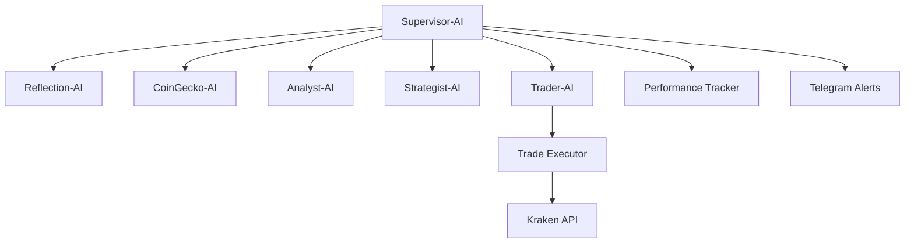

# GPT-5 Kraken Trading Bot

An experimental, fully autonomous cryptocurrency trading bot that uses OpenAI's GPT-5 to manage a portfolio on the Kraken exchange.

> Disclaimer: This is experimental software for educational purposes only. Not financial advice. Use at your own risk.

---

## 🧠 Core Concept

The bot runs on a daily schedule and as a persistent agent. It gathers market intelligence, builds an institutional-grade prompt, obtains an AI trading plan, executes trades, and logs performance. The primary objective is to test whether an AI can generate alpha against BTC and ETH benchmarks.

## 🧩 Current Architecture (Multi‑Agent)

The system is orchestrated by a Supervisor that coordinates specialized agents:



- Reflection-AI: synthesizes compact historical learnings for context (Gemini 2.5 Pro).
- CoinGecko-AI: live prices, trending tokens, validation/fallbacks.
- Analyst-AI: crypto + macro RSS synthesis with CoinGecko context.
- Strategist-AI: builds optimized GPT-5 prompt with portfolio/performance rules.
- Trader-AI: calls GPT-5 with JSON response_format; parses/validates plan.
- Trade Executor: two-phase execution (SELLs settle, refresh, then BUYs) with Kraken-side dry-run validation and min-notional guards.
- Performance Tracker: logs trades/equity/thesis and P&L summaries.
- Telegram Alerts: optional trade summaries (and explicit HOLDs when enabled).

## 🔑 Key Capabilities (Highlights)
- Percentage-based allocations with position size guardrails.
- Validation against Kraken ordermin/costmin; preflight tradability.
- Defensive fallback (approve HOLD) when a valid plan cannot be generated.
- Micro-trade guard: blocks orders < max($25, 5% of equity).
- Explicit HOLD reasoning in AI output (informational; not executed).
- Parallelized early stages (Reflection, CoinGecko, Analyst prefetch) for speed.

See `IMPLEMENTATION.md` for full, evolving details.

---

## ⚙️ Getting Started

### Prerequisites
- Python 3.11+
- Kraken account + API keys (trading permissions as needed)
- OpenAI API key
- Optional: Google Gemini API key (for Reflection-AI)
- Optional: Telegram Bot token + chat ID (for alerts)

### 1) Clone
```bash
git clone <repository-url>
cd chatgpt-kraken-bot
```

### 2) Virtual Env
```bash
# Windows
python -m venv venv
venv\Scripts\activate

# macOS / Linux
python3 -m venv venv
source venv/bin/activate
```

### 3) Install
```bash
pip install -r requirements.txt
```

### 4) Environment (.env)
Minimal:
```env
KRAKEN_API_KEY="your_kraken_api_key"
KRAKEN_API_SECRET="your_kraken_secret_key"
OPENAI_API_KEY="your_openai_api_key"
```
Recommended/optional:
```env
# Models
OPENAI_DEFAULT_MODEL="gpt-5-2025-08-07"
OPENAI_FALLBACK_MODEL="gpt-4o"
GEMINI_API_KEY="your_gemini_api_key"  # used by Reflection-AI

# Telegram alerts
TELEGRAM_BOT_TOKEN="token"
TELEGRAM_CHAT_ID="chat_id"
TELEGRAM_TRADE_ALERTS=1
TELEGRAM_ALERTS_INCLUDE_HOLD=1
TELEGRAM_ALERTS_PARSE_MODE=Markdown
TELEGRAM_ALERTS_SILENT=0
TELEGRAM_ALERTS_MAXLEN=2000

# Pipeline
PIPELINE_PARALLEL_STAGES=1
PARALLEL_MAX_WORKERS=3

# Monitoring verbosity (scheduler)
MONITOR_LOG_EVERY_N=10
MONITOR_SILENT=0
```

---

## ▶️ Usage

### Production scheduler (multi-agent)
```bash
python scheduler_multiagent.py
```
- Schedules the main trading cycle daily at 07:00 MST.
- Runs a lightweight monitoring loop every 60s; triggers full cycle on anomalies (placeholder hooks are present).
- Interactive controls (while running):
  - ENTER: run trading cycle now
  - S: status
  - L: last equity + current live portfolio
  - P: detailed portfolio breakdown
  - T: recent trades
  - D: $10 simulation (no live orders)
  - Ctrl+C: stop

### Single demo run
```bash
python scheduler_multiagent.py demo
```

### Legacy scripts
The legacy `scheduler.py` and monolithic flows are deprecated in favor of the multi-agent scheduler above.

---

## 📤 AI Output Schema (GPT‑5)
GPT‑5 returns a single JSON object with these keys:

```json
{
  "trades": [
    {
      "pair": "ETHUSD",
      "action": "buy",          
      "allocation_percentage": 0.35,
      "confidence_score": 0.8,
      "reasoning": "..."
    }
  ],
  "holds": [
    {
      "pair": "XXBTZUSD",
      "confidence_score": 0.7,
      "reasoning": "Maintain core BTC exposure as dominance stabilizes.",
      "current_allocation_percentage": 0.16
    }
  ],
  "strategy": "ALTCOIN_ROTATION",
  "thesis": "One-paragraph explanation."
}
```

- trades: buy/sell actions with allocation %, confidence, and reasoning.
- holds: informational entries for assets being maintained (no orders placed). These are shown in Telegram alerts (when enabled) and logged in transcripts but not executed.
- strategy: one of MOMENTUM_TRADING, MEAN_REVERSION, ALTCOIN_ROTATION, DEFENSIVE_HOLDING.
- thesis: single paragraph reasoning across the plan.

Constraints implemented (non‑exhaustive):
- Exact Kraken USD pairs; validated ordermin/costmin.
- Micro-trade guard: block < max($25, 5% equity).
- Portfolio-size-aware position limits (e.g., max 40% per position for >$50; small portfolio mandate to avoid 100% cash).
- SELLs first, wait to settle, refresh balances, then BUYs.

---

## 📨 Alerts & Logging
- Telegram: cycle summary, executed trades, and optional Holds section.
  - Toggle via `TELEGRAM_TRADE_ALERTS` and `TELEGRAM_ALERTS_INCLUDE_HOLD`.
- Logs (default ./logs):
  - `trades.csv` — executed trades
  - `equity.csv` — equity time series
  - `thesis_log.md` — thesis history
  - `daily_research_report.md` — Analyst‑AI market report
  - `agent_transcripts/YYYY-MM-DD/*` — full cognitive transcripts per agent

---

## 🧪 Tests
```bash
python -m unittest discover Tests/
```
(Some legacy tests target monolithic components; multi-agent tests are being expanded.)

---

## 📚 Source of Truth
All technical details, edge cases, and change history live in `IMPLEMENTATION.md`. Update it with any change to features, flows, or behavior.
